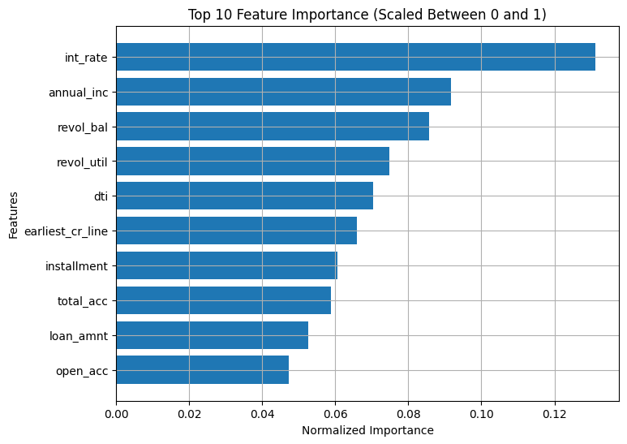

**Aim** 

The aim of this project is to build a reliable machine learning pipeline for predicting loan default using structured financial data. The objective includes:
1. Performing data preprocessing and exploratory data analysis (EDA).
2. Handling missing values and data imbalance
3. Training and tuning multiple classification models including Random Forest, XGBoost, and Artificial Neural Network (ANN)
4. Selecting the best-performing model based on AUC score
5. Building an API using FastAPI to be deployed over cloud.

